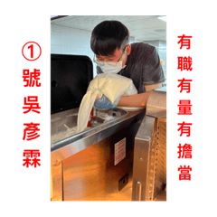

    
    <h1>彥霖的生日整人企劃</h1>
    <h3>㊗️我的前前室友暨台科研究所放棄碩士 @彥霖 22歲生日快樂！ 
    祝福你龍耀七旬新紀跨，壽山詩海任飛騰 
    我的心願是希望你能夠順利成為37屆中原資管系學會會長 
    資管要贏！票投彥霖！</h3>

    <strong><em>本專案為朋友之間進行整人活動，以知名影片串流平台Jable當作網頁切版參考，絕無進行任何商業活動，純屬研究用途，若有不適將立即刪除。</em></strong>

  
  
  
  
  

## 影片播放
本專案使用 Vimeo 上傳影片，並嵌入至 `index.html`。
